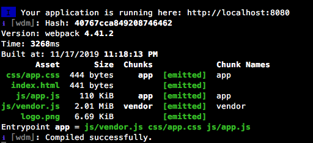

# 扔掉 cli，webpack工程轻量化配置实战

## 前言
之所以说是轻量化配置方案，是相对于Vue、React等框架提供的官方cli工具而言的。并不是说这些cli工具不好，它们本身提供了开箱即用的良好特性，又集成了很多提升开发体验的插件，确实能降低框架使用的门槛。但也正是因为工具高度集成，配置高度抽象，导致生成的webpack配置文件结构略显复杂。对于一个技术选型已趋稳定的前端团队来说，比如一般只会使用一种css预处理方案，以及相对固定的插件集成，所以完全可以固定某些配置选项，从而输出一个轻量的工程配置方案。这也有利于灵活更改或升级某些依赖，从而进一步提升开发体验及输出性能。

## 明确需求
在开始配置之前，还是要明确自身的需求。对于前端应用来说，使用webpack作为工程化工具，我们希望除了静态文件server，babel编译等基本需求外，还能满足以下这些体验及要求：
### 开发阶段
* 利用HMR实现模块热加载，包括css模块
* 尽可能加快首次全量编译及rebuild速度
* 在编译结果中能清晰看到生成的bundle包及chunk文件

### 生产输出
* 压缩优化输出的js、css包，以及其他静态资源
* 合理配置hash，减少非必要更新
* 合理配置分包策略，控制输出包的大小及数量

## 配置方案
本文是以Vue框架应用为例，应用示例用的就是vue-cli生成的工程模板，可以clone [代码仓库](https://github.com/xsbear/vue-webpack4-babel7) 到本地运行。React技术栈的同学也请留步，webpack的配置方案基本是一致的，无非就是babel配置有差异。简化后的方案只在`build`目录下有3个配置文件：`webpack.base.js`, `webpack.dev.js`, `webpack.prod.js`。其中 `dev`与`prod` 分别是开发和生产构建的webpack config文件，在`package.json`中可以配置如下npm scripts用于开发和生产构建：
```json
"scripts": {
    "dev": "webpack-dev-server --inline --progress --config build/webpack.dev.js",
    "build": "cross-env NODE_ENV=production webpack --config build/webpack.prod.js"
}
```

两个文件都继承了`webpack.base.js`，此文件包含了主要配置项，下面就方案的关键配置做下注解。

### webpack.base.js
#### 环境变量、Helper方法
* `devMode` 变量用于区分开发与生产构建
* `resolve` 方法用于拼接绝对路径，base目录为工程根目录
```javascript
const devMode = process.env.NODE_ENV !== 'production';

function resolve (dir) {
  return path.join(__dirname, '..', dir)
}
```

#### 入口和上下文
* 设定上下文为工程根目录
* 入口为 `src` 目录下的 `main.js`，此处路径相对于上下文。可以视项目实际情况配置多个入口。
```javascript
context: resolve(''),
entry: {
	app: './src/main.js'
}
```

#### 输出 output
* `path`指定输出目录为`dist`，所有构建生成的资源都放入此目录
* `filename`  命名输出的bundle文件，这里根据devMode区分，生产构建会加上对应bundle的`chunkhash` ，这里不用 `hash`，是需要精确控制每个bundle的缓存，以满足我们对于生产环境加载优化的需求。尤其是多入口的情况下，如果只更新其中一个业务bundle，其他bundle的hash不变，从而长效利用缓存，减少不必要的资源下载。 `[name]` 会被入口的命名替换，该项目即为`app`。
* `chunkFilename` 命名输出的chunk文件，上面的`filename`是用来控制入口对应的bundle文件，而这个主要是用于分包（splitChunks）以及懒加载等产生的chunk文件，也使用`chunkhash`。 `[name]` 会被分包定义的名称替换。
* 此处输出的bundle文件前面加上了目录`js`，后面的 css、图片等资源也对应加上了目录，这可以根据项目规范来定，没有强制约定。不管是否有前置目录，都是相对于 `output.path`目录的。
* `publicPath`也是一个关键配置，会影响到按需加载或外部资源加载，特别是css中引用的图片、字体等资源，如果设置不正确，有可能导致无法加载，受限篇幅与主题，就不展开讲了。
```javascript
output: {
  path: resolve('dist'),
  filename: devMode ? 'js/[name].js' : 'js/[name].[chunkhash].js',
  chunkFilename: devMode ? 'js/[name].js' : 'js/[name].[chunkhash].js',
  publicPath: '/',
}
```

#### 解析 resolve
主要设置模块如何被解析，包括别名配置，可以提升一定的构建效率，具体看配置，不做展开。

#### optimization: 分包配置 splitChunks
根据项目规模和资源加载性能要求进行合理的分包配置，其中涉及到的参数与原理都会相对复杂，本文也不做展开。本方案里给到的是可以满足中小型应用的通用策略：分出 `common`包与`vendor`包。
* `common`包是针对于多入口应用的，本示例工程其实不起效。对于多入口应用，提取共同依赖模块到`common`包，可以减小每个业务bundle的size，同时也能利用缓存的优势，优化加载性能。还可以通过`minChunks`等参数进一步控制分包粒度。
* `vendor`包是将所有在`node_modules`中的第三方模块全部打包成一个chunk。这样做的一个好处是，相对于业务bundle，第三方依赖的变化频度较低，`chunkhash`可以稳定较长时间。但如果你的项目持续集成是每次重新全量安装构建，那此策略的效果不会很好，因为npm依赖更新频度太高了（主要是minor和patch版本升级，除非是锁定版本）。如果单个包过大，也可以通过`maxSize`等参数进一步拆分。

```javascript
optimization: {
  splitChunks: {
    chunks: 'async',
    name: true,
    cacheGroups: {
      common: {
        name: 'common',
        chunks: 'initial',
        minChunks: 2
      },
      vendor: {
        name: 'vendor',
        test: /[\\/]node_modules[\\/]/,
        chunks: 'all'
      }
    }
  }
}
```

#### module.rules
模块处理规则配置，使用恰当的loader处理各种模块。
* 因为是vue应用，所以需要使用`vue-loader`处理`.vue`文件 。loader的配置基本取自`vue-cli`,具体看源码，需要详细了解的可以查看[官方文档](https://vue-loader.vuejs.org)
* js 模块使用`babel-loader`进行处理，babel的选项可以在`.babelrc`或`package.json`中的`babel`节点单独配置。注意一下 `userBuiltIns`及`corejs`的配置，由于babel编译配置不是本文重点，也不再展开。
```javascript
"presets": [
  [
    "@babel/preset-env",
    {
      "modules": false,
      "targets": {
        "browsers": [
          "> 1%",
          "last 2 versions",
          "not ie <= 8"
        ]
      },
      "useBuiltIns": "usage",
      "corejs": 3
    }
  ]
],
```

* css 模块，根据项目使用的预处理方案配置 `test`及预处理 loader，然后是`css-loader`，最后是用`MiniCssExtractPlugin.loader`将代码提取到css文件中，需配合下面的`plugins`配置。生成的css文件命名规则与`output`配置类似，注意生产构建用的是该插件提供的`contenthash`，也是利用缓存优化。`mini-css-extract-plugin`已经支持了内置 HMR，开发阶段启用`hmr`  option即可，在这之前还需要使用`css-hot-loader`来配合实现css的 HMR。其原理也比较简单， 就是通过重新加载生成的css文件进行样式覆盖。另外，如果是纯前端应用（见下节解释），开发阶段也可以考虑使用`style-loader`来实现 HMR。
```javascript
{
  test: /\.(sa|sc|c)ss$/,
  use: [
    {
      loader: MiniCssExtractPlugin.loader,
      options: {
        hmr: devMode,
      },
    },
    'css-loader',
    // 'postcss-loader',
    // 'sass-loader',
  ],
},
```

* 图片、字体、其他媒体资源等直接用`url-loader`处理，配置`limit`选项可优化请求数，另外命名直接带上`hash`。

#### 插件 plugins
* vue应用需引入 `vue-loader/lib/plugin`。
* 上文提到的MiniCssExtractPlugin配置
```javascript
MiniCssExtractPlugin({
  filename: devMode ? 'css/[name].css' : 'css/[name].[contenthash].css',
  chunkFilename: devMode ? 'css/[id].css' : 'css/[id].[contenthash].css',
}),
```
* 由于本示例应用是纯前端应用（引用资源的入口是html文件），所以还要使用`HtmlWebpackPlugin`插件来处理入口html文件的资源引用注入修改，我们无需关心不同环境构建输出的资源包路径命名差异，插件会自动注入资源引用代码。但如果不是纯前端应用，比如使用了 Node应用框架或其他后端语言框架的模板，则需要考虑如何引入输出后的资源路径了，在本文最后会有所提及，但具体的实践可能需要另开话题分享了。

### webpack.dev.js
webpack.dev.js 是开发环境的webpack config 文件，使用`webpack-merge`继承 webpack.base.js ，内容主要是开发阶段所需的一些特定配置。
* `mode`设为`development` ，会默认使用`DefinePlugin`设置`process.env.NODE_ENV`值为`development`，可在源码中获取区分环境用；另外还会默认启用几个开发阶段所需的插件。
* `devtool` 用于指定source map格式，此示例值为`cheap-module-eval-source-map`，首次构建与重新构建速度相对较快，以及支持行级别的源码映射品质，是开发阶段的推荐格式。
* `devServer`主要是`webpack-dev-server`的配置，包括host，端口，启用hmr、gzip压缩等配置。这里使用了`portfinder`解决开发环境可能的端口冲突，可以根据实际情况决定是否使用。另外使用`copy-webpack-plugin`插件替代`contentBase`，可以用于非 webpack 编译处理的静态资源伺服访问。
* `devServer.stats` 可以配置终端中编译输出的显示信息，以下配置的搭配可以看到每次编译后的bundle、chunk包列表，又不会有大串的编译过程信息干扰，具体可以根据实际需求进行调整。
```javascript
  devServer: {
    stats: {
      colors: true,
      builtAt: true,
      cached: true,
      cachedAssets: true,
      modules: false,
      children: false
    }
  }
```
效果是这样的：



### webpack.prod.js
webpack.prodjs 是生产环境的webpack config 文件，也使用`webpack-merge`继承了 webpack.base.js 的主要配置。在这里设置`mode`值为 `production`，同样使用`DefinePlugin`设置`process.env.NODE_ENV`值为`production`，使用`TerserPlugin`等插件对生产构建输出包进行压缩优化。另外引入`optimize-css-assets-webpack-plugin`插件，对输出的css  bundle也做优化处理。
也可以使用 `babel-minify-webpack-plugin`插件进一步压缩经babel编译的代码，但从实际使用来看，此插件带来的压缩效果并不明显，编译耗时倒是增加不少，可以看具体情况来决定是否使用。

### 小结
至此，轻量版本的webpack工程配置已经完成。可以拉取仓库代码在本地运行体验，工程效果基本是与 vue-cli 生成版本一致的，不过对比vue-cli 的整个应用工程配置， 去除了单测、e2e测试，以及编译错误桌面提醒等插件的集成，可以根据实际需求再行配置。

## 配置工具化
对于需要维护多个项目的团队，为了能让webpack工程配置能尽可能通用，可以考虑将配置方案封装成一个npm包，抽象部分配置项作为可变参数，比如  `publicPath`，一般是不同应用不同值。在应用里可以使用`webpack-merge`，对一些配置进行覆盖或增加，会有更好的灵活性。就如文章开头所提，一个团队内的模块处理方案基本是统一的，所以无需抽象过多配置项，否则又走回 cli 工具的老路了。

## 结语
本文从实战出发，提供了一个相对普适的轻量化webpack工程配置方案。受篇幅所限，没有对一些配置项做过多解释，如果需要了解某个配置细节，可以查询相关文档或文章。有兴趣的同学也可以阅读webpack源码作深入了解。